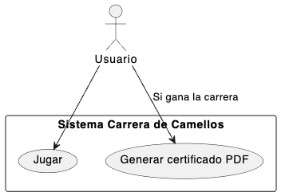
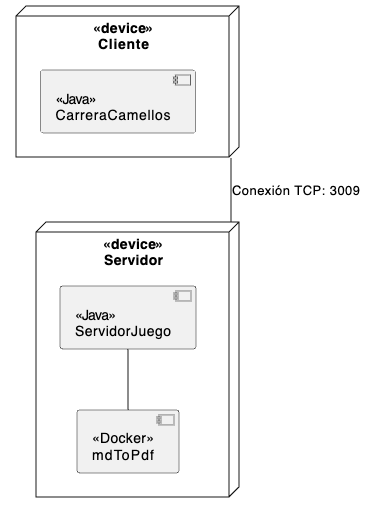
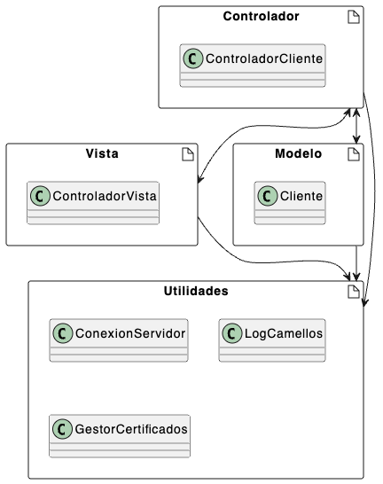
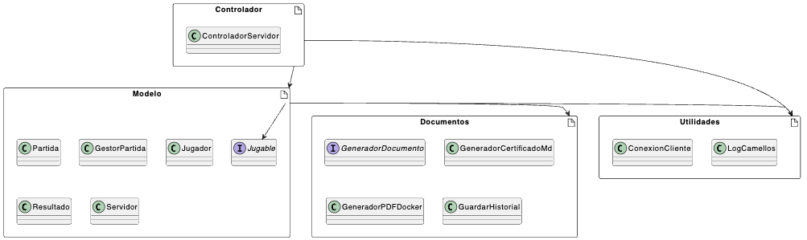
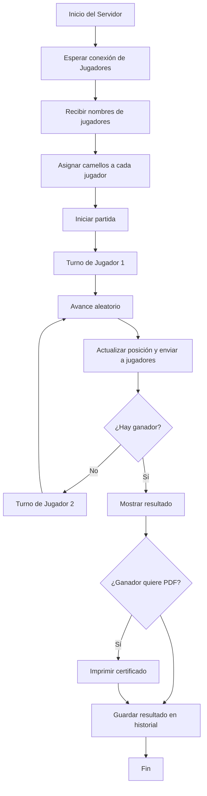
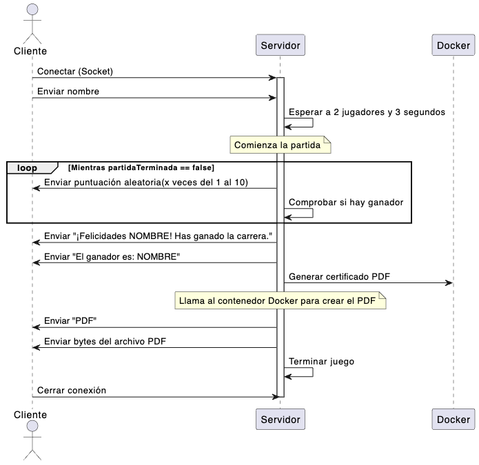
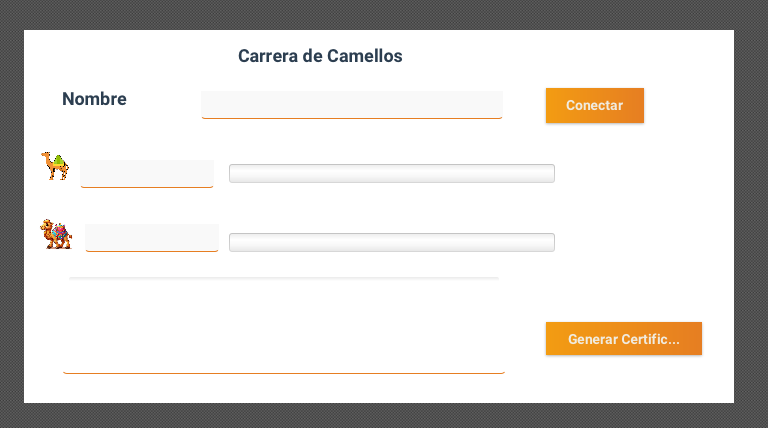

# Carrera de Camellos de Sara Martínez

## Repositorio Github https://github.com/Saykek/AppCamellos.git

## - Análisis y Prototipo

## - Análisis

- ### Reglas del juego:

  En el juego Carrera de Camellos participan 2 jugadores, cada uno de ellos . Cada jugador deberá registrarse con un nombre y una vez registrados empezará la carrear.. El camello que llegue primero será el camello ganador.
  Para avanzar los camellos lo harán de forma aleatoria. El ganador podrá generar un certificado PDF. Se registrarán las partidas.
- ### Requisitos funcionales:

  - Permitir conexión.
  - Permitir jugar.
  - Generar e imprimir un certificado del ganador.
  - Guardar las partidas y resultados.
- ### Requisitos No funcionales:

  - Conexión desde dos equipos diferentes.
  - Registro de dos jugadores con su nombre.
  - El sistema debe estar disponible cuando sea necesario.
  - El sistema debe ser sencillo y fácil de usar.
  - Interactuar a través de interfaz gráfica.
  - Avances extras a través de de preguntas.
  - Guardar partidas y resultados de manera persistente.
  - Avanzar camellos de forma aleatoria.
  - Determinar el ganador e imprimir certificado PDF.
- ### Actores:

  - Usuarios
    - Se registrarán con su nombre, verán como avanzan tanto su camello como el del rival desde la interfaz gráfica y en caso de ganar podrá descargar el certificado.
- ### Casos de uso:

  - Jugar

#### Diagrama Casos de uso

---

## - Arquitectura, diseño y plan de pruebas

 El sistema sigue una arquitectura cliente-servidor con el patrón MVC, donde 2 clientes se conectan al servidor a través de sockets TCP para participar en la carrera de camellos.
 Cada cliente mostrará su propia interfaz gráfica mediante JavaFX, donde se le permitirá registrarse con su nombre, seguir la carrera en tiempo real y en caso de ser ganador podrá descargar su certificado en PDF.
 En el servidor será donde se centralice toda la lógica del juego, incluyendo el registro de jugadores, los avances, el control del vencedor y  el almacenamiento de las partidas y  generación del certificado, que lo generará en markdown para después convertirlo a través de docker en PDF.

### Arquitectura Cliente - Servidor

- Diagrama de despliegue:

- Diagrama de componentes Cliente:

- Diagrama de componentes Cliente:
- 

- ### Diagrama de flujo:

- ### Protocolo de comunicación:
- La conexión se hará con TCP
- Se usarán hilos
- El puerto será el 3009
- Los mensajes serán tipo texto
- Si un cliente pierde la conexión no pasa nada, la partida continúa. El servidor permanece abierto tras cada partida para permitir la conexión de nuevos jugadores y la ejecución de partidas adicionales sin necesidad de reiniciar el servicio. El cierre de la conexión se realiza a nivel de cada cliente, liberando recursos tras finalizar su participación, mientras que el servidor continúa disponible para nuevas solicitudes de conexión.
- ### Protocolo de conexión

  - Los clientes se conectarán al servidor, podrán conectarse hasta 2 personas(por partida). Se registrarán enviando su nombre y se les asignará un camello.
  - Una vez que estén registrados los dos jugadores el servidor hará una breve pausa e irá asignando aleatoriamente valores del 1 al 10 a cada jugador.  Cuando un jugador llegue a la meta ( en mi caso he puesto llegar a 100 puntos)se dará por finalizada la carrera y se le generará al jugador vencedor el certificado PDF. Ambos jugadores recibirán un mensaje final recibiendo la enhorabuena o diciéndoles quien gano."

- ### Tecnologías a usar:
- Interfaz gráfica: La interfaz gráfica a utilizar será JavaFX con Scene Builder.
- Comunicación: Se utilizarán socket TCP.
- Programación: Se utilizará Java en Visual Studio Code.
- Se utilizarán hilos para los jugadores y la lógica del juego.
- Para la persistencia de los datos de las partidas se usará un archivo de texto.
- Para la conversión de markdown a PDF se usará Docker.
- ### Desarrollo de la interfaz:

  - Se desarrollará con Scene Builder, será una interfaz sencilla donde se vayan mostrando los avances de cada camello en una barra de progresión, al lado de esta la suma total de los puntos en cada momento. Tendrá un espacio para mostrar los mensajes y donde se pondrá la puntuación obtenida en cada turno. Al ganador se le mostrará un botón para generar el certificado.También cuenta con un botón para conectar, el cual una vez empezada la partida se deshabilitará, y se volverá a habilitar a la finalización de esta.
    Se mostrará todo en una única pantalla.

### - Prototipo

En esta fase muestro como será la estructura del proyecto y un prototipo de la pantalla.

### Estructura del proyecto

El programa esta organizado en dos proyectos, por un lado tenemos el cliente y por otro el servidor. Dentro de cada proyecto se organiza en paquetes.
Tanto en un proyecto como otro tenemos una estructura con MVC (aunque no disponemos de paquete vista en servidor), donde separamos responsabilidades.
En el servidor ademas tendremos un paquete llamado documentos para guardar todas las clases relacionadas con la generación de documentos. También contamos con paquete utilidades que será desde donde controlemos todos los logs. Fuera de esto tenemos otro paquete llamado documentación con los diseños de los diagramas y la documentación sobre los proyectos y también contamos con otro paquete donde guardaremos los certificados obtenidos. También se encuentra el fichero donde se guardan los log, el fichero donde se guardan las partidas, y un paquete más con las pruebas oportunas para los proyectos.
En el cliente mantenemos MVC, y este si que contiene los tres paquetes.También contamos con un paquete de utilidades donde se gestionan los log, certificados y conexiones. Fuera tendremos la clase con la que pondremos en marcha el programa, un paquete llamado resources con los recursos utilizados y un paquete con todas las pruebas oportunas.

### Interfaz inicial (JavaFX)

Se ha diseñado un prototipo básico de la pantalla,arriba parte central tenemos el nombre del juego, debajo de esto permite que el jugador introduzca su nombre y se conecte al servidor, en la parte inferior a la derecha habrá un botón que sólo se mostrará en caso de resultar vencedor, donde podrá generar el certificado PDF, en el lado izquierdo de ésto hay una ventana donde se mostrarán los mensajes enviados por el servidor.

  

---

## Plan de Pruebas

### Pruebas Manuales

#### 🔹 Pruebas de Funcionalidad

| ID | Nombre                   | Objetivo                                                        | Procedimiento                                      | Resultado Esperado                                                   | Evidencia                                                                                                                                                                                                                                                                                                               |
| -- | ------------------------ | --------------------------------------------------------------- | -------------------------------------------------- | -------------------------------------------------------------------- | ----------------------------------------------------------------------------------------------------------------------------------------------------------------------------------------------------------------------------------------------------------------------------------------------------------------------- |
| M1 | Conexión                | Verificar que los dos clientes pueden conectarse correctamente  | Iniciar el servidor y conectar los dos clientes    | El servidor reconoce a los dos clientes y comienza la partida        |                                                                                                                                                                                                                                                                                                                         |
| M2 | Avance del juego         | Comprobar que el servidor actualiza el avance de cada camello   | Iniciar partida y dejarla avanzar automáticamente | El progreso de los camellos se muestra correctamente en los clientes |                                                                                                                                                           |
| M3 | Fin de partida y ganador | Verificar que se detecta el final de la partida y se genera PDF | Jugar hasta que un camello gane                    | Se muestra el ganador y se genera el certificado PDF                 | ,  |
| M4 | Nombre vacío            | Asegurar que introducen un nombre                               | Intentar conectar sin introducir nombre            | Se muestra mensaje de error y no deja continuar                      |                                                                                                                                                                                                                                                                                                                         |

#### 🔹 Pruebas de Interfaz

| ID | Nombre                        | Objetivo                                                               | Procedimiento                               | Resultado Esperado                                            | Evidencia                                                                                                                                                |
| -- | ----------------------------- | ---------------------------------------------------------------------- | ------------------------------------------- | ------------------------------------------------------------- | -------------------------------------------------------------------------------------------------------------------------------------------------------- |
| I1 | Verificación de botones      | Asegurar que los botones funcionan como se espera                      | Pulsar cada botón en diferentes momentos   | Se ejecutan las acciones esperadas sin errores                | -                                                                                                                                                        |
| I2 | Imágenes                     | Comprobar que las imágenes se cargan correctamente                    | Iniciar la aplicación                      | Todas las imágenes se muestran correctamente en los clientes |  |
| I3 | Botón "Conectar" desactivado | Verificar que el botón "Conectar" se desactiva durante la partida     | Pulsar "Conectar" y luego intentar pulsarlo | El botón se desactiva y no se puede volver a pulsar          |  |
| I4 | Botón "Conectar" activado    | Verificar que el botón "Conectar" se activa cuando la partida termina | Esperar fin de partida y pulsar "Conectar"  | El botón se activa y se puede volver a pulsar                |  |

#### 🔹 Pruebas de Mal Funcionamiento

| ID | Nombre                   | Objetivo                                                 | Procedimiento                                     | Resultado Esperado                                                           | Evidencia                                                                                                                                                |
| -- | ------------------------ | -------------------------------------------------------- | ------------------------------------------------- | ---------------------------------------------------------------------------- | -------------------------------------------------------------------------------------------------------------------------------------------------------- |
| E1 | Conexión de 3º cliente | Verificar qué ocurre si se conecta un tercer cliente    | Conectar un tercer cliente después de dos        | El servidor no permite la conexión en la misma partida y lo redirige a otra |  |
| E2 | Cliente desconectado     | Verificar cómo actúa el servidor ante una desconexión | Cerrar uno de los clientes en mitad de la partida | El servidor continúa hasta finalizar la partida                             | -                                                                                                                                                        |

---

### Pruebas Automáticas (JUnit - Planeadas)

| ID | Nombre                      | Objetivo                                                      | Método Probado                                  |
| -- | --------------------------- | ------------------------------------------------------------- | ------------------------------------------------ |
| A1 | Avances de camellos         | Verificar que los camellos avanzan correctamente              | `Camello.avanzar(int puntos)`                  |
| A2 | Actualización de posición | Comprobar que se actualiza correctamente el progreso visual   | `ControladorVista.actualizarProgresoCamello()` |
| A3 | Datos del jugador           | Verificar que se registra correctamente el nombre del jugador | `Cliente.conectar(String nombre)`              |
| A4 | Generación de historial    | Verificar que se guarda correctamente el historial            | `GuardarHistorial.guardar()`                   |

Evidencia de realización de pruebas automáticas : [Ver archivo](https://github.com/Saykek/imagenes_camellos/blob/f42f6274562a8197651be285b7764959a394a597/pruebas.txt)

---

### Registro de Ejecución de Pruebas

| ID | Resultado de la prueba | Observaciones                                                |
| -- | ---------------------- | ------------------------------------------------------------ |
| M1 | ✅ Correcto            | Ambos clientes conectan sin errores                          |
| M2 | ✅ Correcto            | Progreso se actualiza fluidamente en ambos clientes          |
| M3 | ✅ Correcto            | Ganador mostrado correctamente y PDF generado                |
| I1 | ✅ Correcto            | Todos los botones funcionan como se espera                   |
| I2 | ✅ Correcto            | Todas las imágenes visibles correctamente                   |
| I3 | ✅ Correcto            | El botón "Conectar" se desactiva tras pulsarlo              |
| I4 | ✅ Correcto            | El botón "Conectar" se activa tras terminar la partida      |
| E1 | ✅ Correcto            | El servidor redirige al tercer cliente a otra partida        |
| E2 | ✅ Correcto            | El servidor continúa la partida                             |
| A1 | ✅ Correcto            | Método probado con distintos puntos                         |
| A2 | ✅ Correcto            | Progreso actualizado según parámetros recibidos            |
| A3 | ✅ Correcto            | Nombre del jugador registrado correctamente en conexión     |
| A4 | ✅ Correcto            | Archivo de historial generado y contiene los datos esperados |
